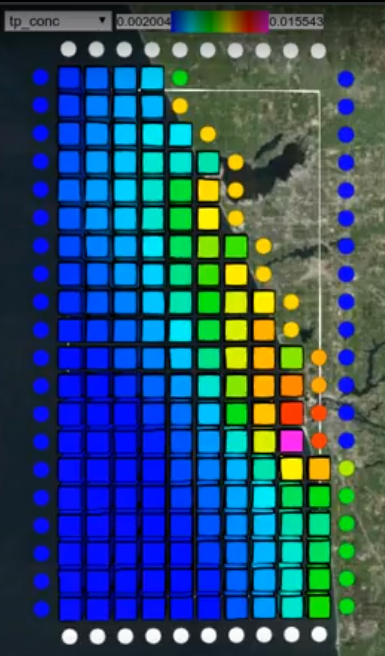
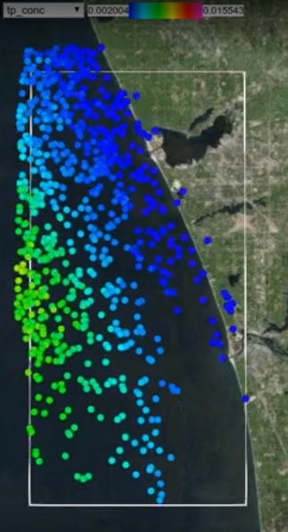
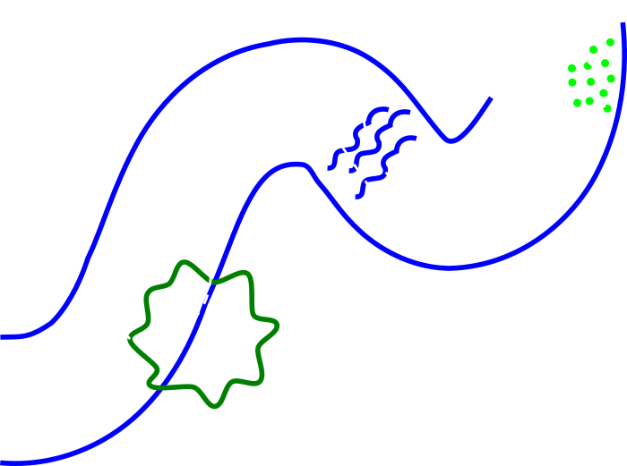
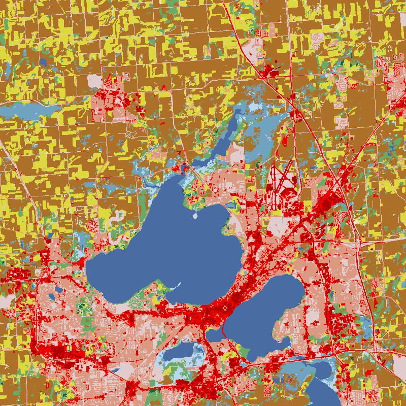
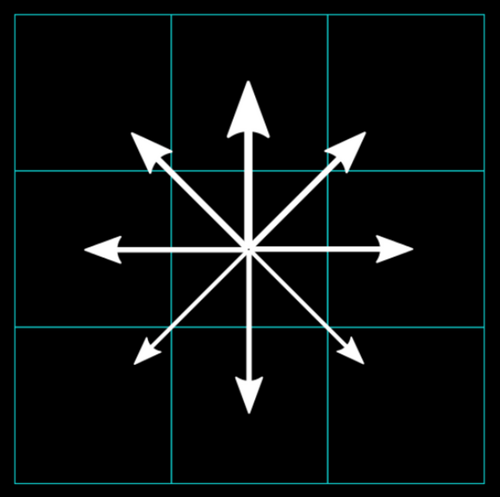
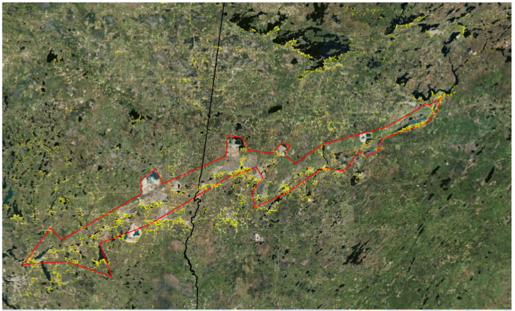
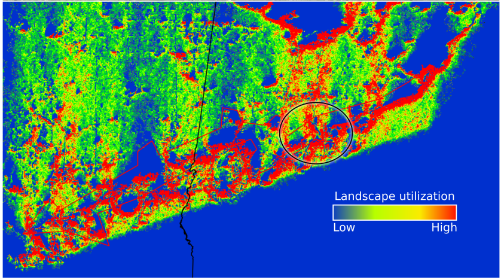

# Agent Based Models

## in (landscape) ecology

# Based on: Applications of agent-based modeling to nutrient movement Lake Michigan
<!-- .slide: data-state="hide-head" -->
<!-- .slide: data-background="img/png/title.png" data-background-size="contain" -->

<!--

## Terry N Brown, James Pauer, Tom P Hollenhorst

http://tbnorth.github.io/solm_agents
-->

## Grid and agent models...

 <!-- .element height="500" -->
&nbsp;&nbsp;&nbsp;&nbsp;
 <!-- .element height="500" -->

## Cell (or grid) based models

- divide space up into squares, maybe layered (3D)
- represent levels / categories of phenomena across
  space uniformly (fully mixed) within cells
- time steps move content between cells (mass balance,
  concentration, etc.)

<iframe src="https://www.youtube.com/embed/AJpi2ShsUfg?rel=0&amp;controls=1&amp;showinfo=0?ecver=2" width="480" height="360" frameborder="0" style="position:absolute;width:100%;height:100%;left:0" allowfullscreen></iframe>

## Agents

- exist at a specific point in space
- can have multiple static and varying attributes
- can interact with surrounding agents (and cells)
  based on distance etc.
- added and removed from the model over the model's
  run-time

## Agent Based Model (ABM)

- Google agent based model - most hits are in
  social science, mostly behavior / decision making /
  social networks / media type interactions
- Modeling people as agents allows complex life
  histories to be tracked
- E.g. pollutant exposure, a model with child and adult agents
  can show how a small part of the population carries a
  contaminant load from childhood to adulthood - ABMs good
  out outliers

## Agents as individuals

## Agent interactions

- run ABM with dozens / hundreds / thousands of agents...
- competition for food / shade
- big fish / little fish
  - how does time spent hiding impact time
    spent feeding?
- effectiveness of different behaviors / foraging
  strategies

Complexity more easily represented in ABMs

## Boids

<iframe width="560" height="315" src="https://www.youtube.com/embed/zQhEGPrINJo?rel=0&amp;showinfo=0" frameborder="0" allow="autoplay; encrypted-media" allowfullscreen></iframe>

Gavin Wood / YouTube

## (NLCD land cover data)

30 x 30 m grid of land use categories

## Agents on a grid - landscape fragmentation

- Agents at grid cells rather than coordinates
- Very simple rules, move randomly, with bias

 <!-- .element height="425" -->

## Impassable cells

## Landscape utilization

## Dead ends

## Implementation

- Relatively easy to code in any generic programming language
  (Python, R, JavaScript, C, etc.)
- Probably lots of frameworks too, ask Google :)

## Agents for continuous phenomena

- historically agent based modeling focused on distinct
  entities (fish in streams, etc.)
- modern computational power allows large numbers of
  agents to approximate continuous phenomena
- often used to model plumes / spills

## Cell (grid) based models

- computationally efficient (*if* vectorized)
- cover modeled space completely
- integrate with GIS etc.

## Agents

- more precise for some spatial questions
- can more easily represent complex life histories
- can represent more complex spatial arrangements
- variable density can allow more detail where needed

<!-- .slide: data-background="img/png/gridagent000.png" data-background-size="contain" -->

<!-- .slide: data-background="img/png/gridagent010.png" data-background-size="contain" -->

<!-- .slide: data-background="img/png/gridagent020.png" data-background-size="contain" -->

<!-- .slide: data-background="img/png/gridagent030.png" data-background-size="contain" -->

## Nearshore model

- Nutrient movement in the nearshore - Harmful Algal Blooms etc.
- Nearshore - where nearshore stuff happens
- Nearshore stuff: tributary loads, re-suspension, longshore flow, etc.
- Fuzzy boundary, nearshore ~100% of the time at 5 m, but
  maybe only 5% of the time at 50m
- Tributary loads retained in nearshore for a long time, relative
  to seasonal dynamics

<iframe src="https://www.youtube.com/embed/ihdx9SCcS5Q?rel=0&amp;controls=1&amp;showinfo=0?ecver=2" width="480" height="360" frameborder="0" style="position:absolute;width:100%;height:100%;left:0" allowfullscreen></iframe>

<iframe src="https://www.youtube.com/embed/z2cA9vZoPkA?rel=0&amp;controls=1&amp;showinfo=0?ecver=2" width="480" height="360" frameborder="0" style="position:absolute;width:100%;height:100%;left:0" allowfullscreen></iframe>

<iframe src="https://www.youtube.com/embed/LKLIabY-y6c?rel=0&amp;controls=1&amp;showinfo=0?ecver=2" width="480" height="360" frameborder="0" style="position:absolute;width:100%;height:100%;left:0" allowfullscreen></iframe>

<!-- .slide: data-background="img/png/nearshore_contrib0.png" data-background-size="contain" -->
<!-- .slide: data-background-color="white" -->

<!-- .slide: data-background="img/png/nearshore_contrib1.png" data-background-size="contain" -->
<!-- .slide: data-background-color="white" -->

<!-- .slide: data-background="img/png/nearshore_contrib2.png" data-background-size="contain" -->
<!-- .slide: data-background-color="white" -->

## Direction

- *possible* future work: a tool that:
- shows relative contributions to nearshore from
  different tributaries.
- shows impact of timing of loads (flow, fertilizer
  application dates, etc.)
- gives “as of yesterday” estimates of current
  conditions

## Challenges

- Visualization - complex systems, but avoid complex
  interfaces
- Loadings - realistic **daily** loading data for all major
  Great Lakes tributaries not readily available
- Integration with watershed / landscape models
- Validation - multi-year / date / location data on nearshore
  conditions scarce

<iframe src="https://www.youtube.com/embed/9xWGsL7qCIg?rel=0&amp;controls=1&amp;showinfo=0?ecver=2" width="480" height="360" frameborder="0" style="position:absolute;width:100%;height:100%;left:0" allowfullscreen></iframe>

Brown.TerryN | Pauer.James | Hollenhorst.Tom @epa.gov

<iframe src="https://www.youtube.com/embed/9xWGsL7qCIg?rel=0&amp;controls=1&amp;showinfo=0?ecver=2" width="480" height="360" frameborder="0" style="position:absolute;width:70%;height:70%;left:15%" allowfullscreen></iframe>

